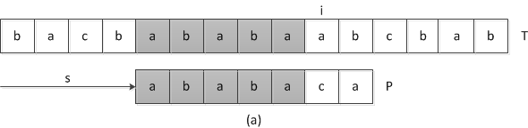
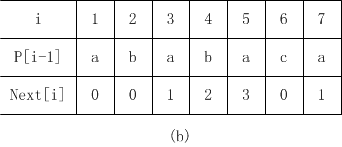
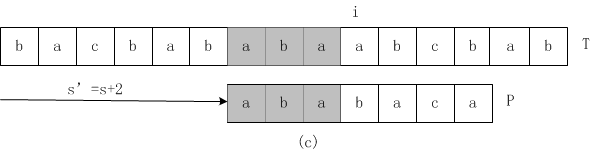
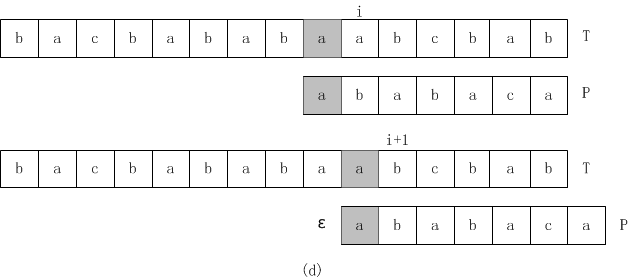

# KMP 算法

一种由Knuth、Morris和Pratt三人设计的线性时间字符串匹配算法，匹配时间为$\Theta(n)$,需要借助辅助函数next,它在$\Theta(m)$时间内根据模式预先计算出来，并且存储在数组next[1..m]中。

首先，我们考察一下朴素字符串匹配算法的操作过程。图（a）展示了在一个特定偏移s时，文本T匹配模板P的具体情况。 

 

从图中可以看出，只有q=5个字符匹配成功，在模式P匹配第6个字符时,匹配不成功，此时按照朴素字符串匹配算法，应该偏移s加1,在从头将模式P与文本T进行匹配。而KMP算法利用当前匹配成功的字符，通过预先计算的`next`数组，计算下一次匹配位置，不需要从头将模式P与文本T进行匹配。而`next[q]`(与P相对应的'next'数组如图（b）)记录模板P前q个字符的前缀与后缀的最大匹配字符串长度（**不包括字符自身**）。 

 

这样我们就能通过`next[q]`知道我们下一次偏移增加的最小值`q-next[q]`,同时也能知道此时能够匹配`next[q]`个字符，如图（a）,此时匹配成功的字符串长度`q = 5`,根据图（b）中的`next[5] = 3`,由此我们可以再次基础上再次偏移`q-next[q]=5-next[5]=2`,得到图（c）。 

 

以至于我能从模板P的第`next[q]+1=4`个字符与文本 T的第i个字符开始匹配，当匹配不成功时，再次利用`next[next[q]]=next[3]=1`重新计算新的偏移量，直到匹配成功或当前以匹配的字符串长度等于0，**文本T中相应的i前进1,匹配成功的字符长度加1**(具体过程看图d)， 

 

而不必从模板P的第一个字符开始匹配,且偏移不用一次只增加1,当匹配成功的字符串长度等于模板P的长度时，字符串匹配成功一个。 

代码详见[string_match.h](https://github.com/xuelang-wang/Introduction-to-Algorithms/blob/master/Introduction-to-Algorithms/src/string_match.h)

